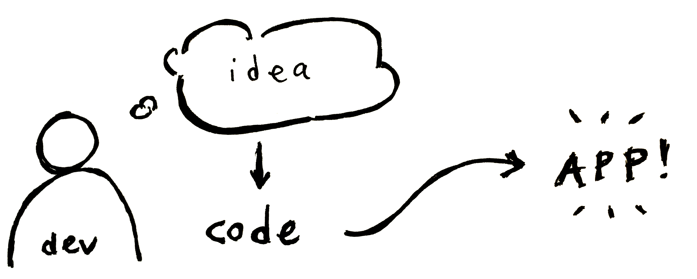
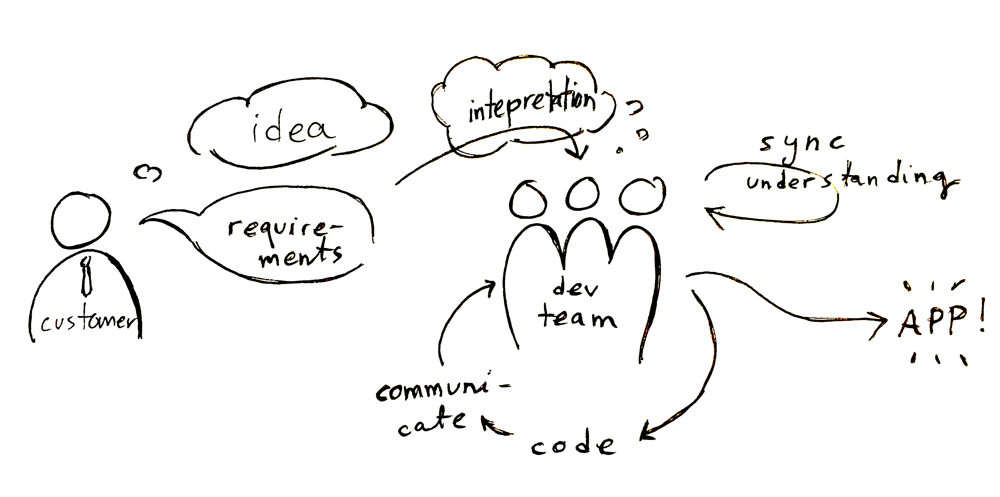
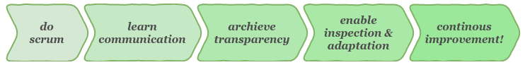

# Learning goals of 'Software engineering lab'
**_..and how Scrum helps us achieve them?_**

### Intro

[Software engineering lab](https://courses.helsinki.fi/en/tkt20007) is one of the final courses in the bachelor's programme in Computer Science in the University of Helsinki. Students are divided into 4-6 person teams and a real customer will be assigned to each team. The team will build a piece of software according to the specifications given by the customer. The implementation requires a vast amount of skills gathered from various courses on topics like [programming](https://courses.helsinki.fi/en/tkt10002), [databases](https://courses.helsinki.fi/en/tkt10004), [web development](https://courses.helsinki.fi/en/tkt21009/) and [software engineering methods](https://courses.helsinki.fi/en/tkt20006). However the learning goals of this course are quite different from any of these. This is because coding for a customer with a team is very different from personal projects or programming course exercises.

### Personal project vs team work

When you're building a personal project, you're the one who's creating the requirements and implementing them. So its simple like this:

  

When you're building a project for a customer, then it's he or she who's creating the requirements. This means that you need to communicate in order to know what to build. And when you got a whole team doing the implementation, you need to coordinate and communicate with the team to know who's building what. That looks more like this:

  

The students should already have the technical skills for creating software but communication and team work are not practiced much in the theoretically and technically focused programme. Communication is challenging both with the customer and within the team. The communication overhead seems amaze the students over and over again. The main learning goal of Software engineering lab may be reduced to one word - **communication**.

### Teaching communication with scrum

Software used to be build with the waterfall method. This can be seen as a two step process: 1) collect requirements from the customer 2) implement the software. This has proven to be a difficult method. Agile methodologies have gained popularity and they seem to be the prevalent way of building software today. In Software engineering lab the students are also required to use agile methodologies, namely Scrum.

Why do we enforce a specific framework? When we analyse the events and artefacts of Scrum we notice that they are actually methods communication. And in the two week sprints the students get to practice them efficiently in a iterative fashion. So by using Scrum the teams will practice a lot of communication.

| Scrum item |Communication? |
|:-----------|:---------------|
| Sprint planning | Customer communicates their requirements to the team. |
| Sprint review | Validating the finished work with the customer. |
| Daily scrum | Coordinating within the team. What has been done? What's next? Any challenges etc? |
| Retrospective | Disclose all the successes and obstacles of the last sprint to enable improving on the next one |
| Product backlog | Written communication of requirements and project progress between the customer and the team. |
| Sprint backlog | Written communication of sprint progress and "who's doing what". |

It's useful to analyse these items also from the perspective of the _Three Pillars of Empiricism_ in Scrum: 1) Transparency 2) Inspection and 3) Adaption. Inspection and adaptation are so closely linked that we will analyse them together.

**Transparency**
* All of the events and artefacts of Scrum improve transparency. Transparency is almost synomous to communication in this context. Suitably extensive and accurate communication in events and artefacts results in good transparency.
  
**Inspect & Adapt**
* Review and Sprint planning
  * Finished work is validated _(inspect)_ and requirements are refined _(adapt)_ if necessary.
* Daily scrum
  * Obstacles are identified _(inspect)_ and appropriate actions the taken to tackle them _(adapt)_.
* Retrospective
  * Things enhancing and impairing teams performance are identified _(inspect)_ and practices are improved _(adapt)_.
* Product backlog
  * Written counterpart of sprint planning & review - same aspect apply.
* Sprint backlog
  * Written counterpart of daily scrum - same aspect apply.

### Connecting the dots

By doing this analysis we are starting to see a connection:

1. Use Scrum
2. Having regural and frequent meetings and using backlogs teaches the students how to communicate better
3. Good communication &rarr; Good transparency
4. Transparency enables inspection of progress, workflow, practices etc.
5. Inspection enables adaptation. This is crucial for students or any teams to develop their skills and performance. 

This brings us to another learning goal of the course - **continuous improvement**. The ability to make observations, analyse them and make suitable adaptations to improve is highly valuable. This is nicely embedded into the values and iterative methods of Scrum.

### Evaluation

The course instructor can use following questions to evaluate team success on communication and continous improvement. Any team can use these same questions to evaluate themselves.
* Are customers requirements communicated in such precision that makes completion of User Stories possible?
* Are customers requirements communicated in such precision that there are no conflicting intepretations that hinder development?
* Does lack of communication within the team (verbal or written) cause confusion or duplicate code? Or 'forgotten tasks'?
* Does the team recognize problems in their workflow, practices, etc?
* Is the team able to adapt/improve on the results of inspection?
* If aspects are in good order, is this because of individual accomplishments or establised practices?
